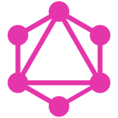
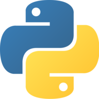

# GraphQL-ed-Flask

Just trying out the Flask(Python) and GraphQL bindings for the first time.

### Some Theory, Just Before Getting Started

<p align="center">


<h5 align="center">GraphQL with Graphene</h5>
</p>

> GraphQL is a query language for APIs and a runtime for fulfilling those queries with your existing data. GraphQL provides a complete and understandable description of the data in your API, gives clients the power to ask for exactly what they need and nothing more, makes it easier to evolve APIs over time, and enables powerful developer tools. -(https://graphql.org/)
>
> Graphene-Python is a library for building GraphQL APIs in Python easily, its main goal is to provide a simple but extendable API for making developers' lives easier. -(https://graphene-python.org/)

<p align="center">


<h5 align="center">Python with Flask</h5>
</p>

> Python is an easy to learn, powerful programming language. It has efficient high-level data structures and a simple but effective approach to object-oriented programming. Python’s elegant syntax and dynamic typing, together with its interpreted nature, make it an ideal language for scripting and rapid application development in many areas on most platforms. -(https://www.python.org/)
>
> Flask is a micro web framework written in Python. It is classified as a microframework because it does not require particular tools or libraries. It has no database abstraction layer, form validation, or any other components where pre-existing third-party libraries provide common functions. -(https://flask.palletsprojects.com/en/1.1.x/)

### How To Use/Run/Execute

1. Either fork the repository or directly clone the repository onto your local machine using

   ```bash
   $git clone https://github.com/swapnanildutta/GraphQL-ed-Flask.git
   ```

2. Create a virtual environment and activate the environment.

   ```bash
   $python3 -m venv venv
   $source venv/bin/activate
   ```

3. Install the dependencies from `requirements.txt

   ```bash
   $pip3 install -r requirements.txt
   ```

4. Finally, run the `main.py` in root directory.

   ```bash
   $python3 main.py
   ```

5. Open the given link in the terminal with a `/graphql` after it, like [http://127.0.0.1:5000/graphql](http://127.0.0.1:5000/graphql).

   ```python
    * Serving Flask app "books.app" (lazy loading)
    * Environment: production
      WARNING: This is a development server. Do not use it in a production deployment.
      Use a production WSGI server instead.
    * Debug mode: on
    * Running on http://127.0.0.1:5000/ (Press CTRL+C to quit)
    * Restarting with stat
    * Debugger is active!
    * Debugger PIN: 290-834-526
   ```

#### Reference

- [Python-Flask-with-GraphQL-Server](https://www.notion.so/Python-Flask-with-GraphQL-Server-implementing-SQLAlchemy-graphene-and-SQLite-by-Pablo-A-Del-V-b0f99904b930444c93288b9d07bd2d1a#5eba2b3417ee499db5a4b97b261c9d5b)
